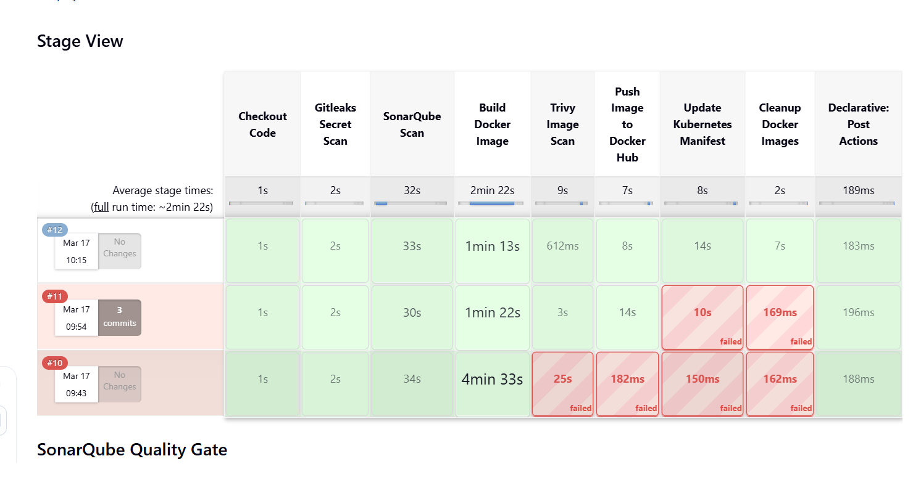
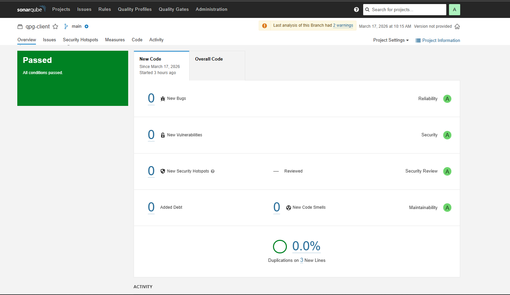
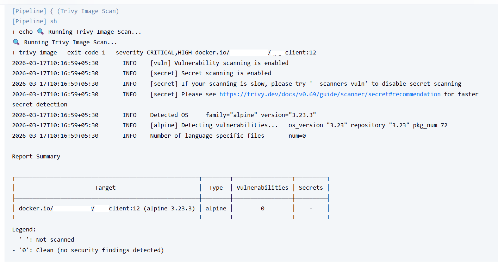
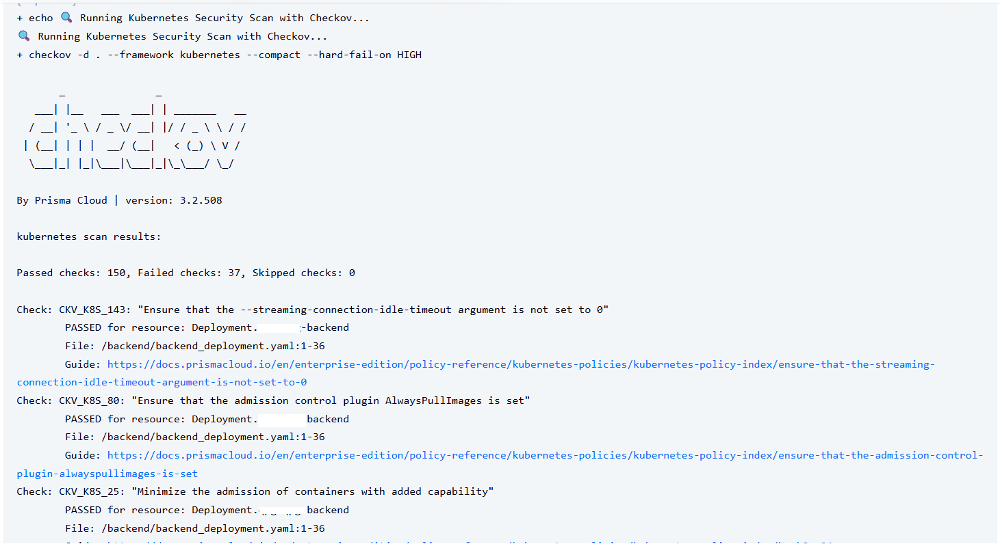
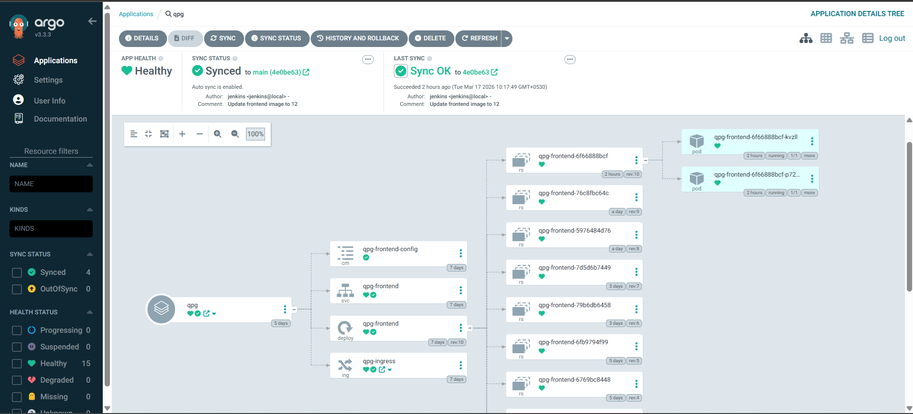
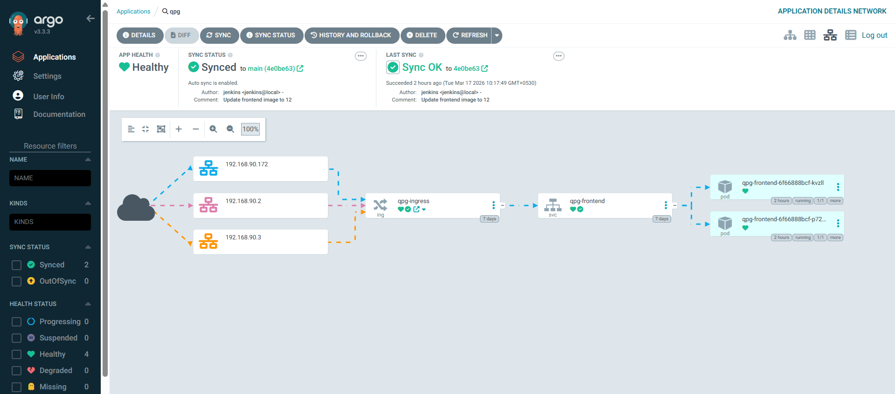

# 🚀 Production-Ready Jenkins CI/CD Pipeline (DevSecOps)

This repository demonstrates a **production-ready DevSecOps CI/CD pipeline** built using Jenkins and integrated with modern security and deployment tools.

It follows **shift-left security** and **GitOps principles** using ArgoCD.

---

## 📌 🔧 Tech Stack

* 🔐 **Gitleaks** – Secret Detection
* 📊 **SonarQube** – Code Quality Analysis
* 🐳 **Docker** – Containerization
* 🔍 **Trivy** – Container Image Security Scan
* ☸️ **Kubernetes** – Container Orchestration
* 🛡️ **Checkov** – Infrastructure as Code Security
* 🚀 **ArgoCD** – GitOps Continuous Deployment

---

## 📂 📁 Project Structure

```
.
├── Jenkinsfile
├── Dockerfile
├── k8s-manifests/
│   ├── frontend_deployment.yaml
│   └── service.yaml
├── screenshots/
```

---

## ⚙️ 🔧 Prerequisites

Ensure the following tools are installed on your Jenkins agent:

| Tool      | Purpose                  |
| --------- | ------------------------ |
| Jenkins   | CI/CD automation         |
| Docker    | Build & push images      |
| kubectl   | Kubernetes interaction   |
| Gitleaks  | Secret scanning          |
| SonarQube | Code quality analysis    |
| Trivy     | Image vulnerability scan |
| Checkov   | Kubernetes security scan |

---

## 🛠️ Installation Guide

### 1️⃣ Install Jenkins

```bash
sudo apt update
sudo apt install openjdk-17-jdk -y

wget -q -O - https://pkg.jenkins.io/debian/jenkins.io.key | sudo apt-key add -
sudo sh -c 'echo deb https://pkg.jenkins.io/debian binary/ > /etc/apt/sources.list.d/jenkins.list'

sudo apt update
sudo apt install jenkins -y
sudo systemctl enable jenkins
sudo systemctl start jenkins
```

---

### 2️⃣ Install Docker

```bash
sudo apt install docker.io -y
sudo systemctl start docker
sudo systemctl enable docker

sudo usermod -aG docker jenkins
```

---

### 3️⃣ Install kubectl

```bash
curl -LO "https://dl.k8s.io/release/$(curl -L -s https://dl.k8s.io/release/stable.txt)/bin/linux/amd64/kubectl"

chmod +x kubectl
sudo mv kubectl /usr/local/bin/
```

---

### 4️⃣ Install Gitleaks

```bash
wget https://github.com/gitleaks/gitleaks/releases/latest/download/gitleaks-linux-amd64
chmod +x gitleaks-linux-amd64
sudo mv gitleaks-linux-amd64 /usr/local/bin/gitleaks
```

---

### 5️⃣ Install Trivy

```bash
sudo apt install wget apt-transport-https gnupg lsb-release -y

wget -qO - https://aquasecurity.github.io/trivy-repo/deb/public.key | sudo apt-key add -
echo deb https://aquasecurity.github.io/trivy-repo/deb $(lsb_release -sc) main | sudo tee -a /etc/apt/sources.list.d/trivy.list

sudo apt update
sudo apt install trivy -y
```

---

### 6️⃣ Install Checkov

```bash
pip install checkov
```

---

### 7️⃣ Setup SonarQube

```bash
docker run -d --name sonarqube -p 9000:9000 sonarqube:lts
```

Access:

```
http://<your-server-ip>:9000
```

Default login:

```
admin / admin
```

---

## 🔑 Jenkins Configuration

### 🔐 Add Credentials

```
Manage Jenkins → Credentials
```

| ID                       | Usage                     |
| ------------------------ | ------------------------- |
| github                   | Clone source code         |
| dockerhub-credentials-ID | Push Docker image         |
| git-cred-ID              | Push Kubernetes manifests |

---

### ⚙️ Configure Tools

```
Manage Jenkins → Global Tool Configuration
```

* Add **Sonar Scanner**
* Name: `sonar-scanner`

---

### 🔗 Configure SonarQube

```
Manage Jenkins → Configure System
```

* Add SonarQube Server
* Name: `SonarQube`
* Add authentication token

---

## 🚀 Pipeline Workflow

1. 📥 Checkout Code
2. 🔐 Run Gitleaks (Secrets Scan)
3. 📊 SonarQube Code Analysis
4. 🐳 Build Docker Image
5. 🔍 Trivy Image Scan
6. 📦 Push Image to Docker Hub
7. ☸️ Update Kubernetes Manifests
8. 🛡️ Checkov Security Scan
9. 🚀 ArgoCD Sync Deployment
10. 🧹 Cleanup Docker Images

---

## 📸 Pipeline Execution (Proof)

### 🚀 Jenkins Pipeline



---

### 📊 SonarQube Dashboard



---

### 🔍 Trivy Security Scan



---

### 🛡️ Checkov Scan (CLI Output)



---

## 🚀 GitOps Deployment using ArgoCD

This project follows **GitOps workflow**:

* Jenkins updates Kubernetes manifests
* Changes pushed to GitHub
* ArgoCD automatically detects changes
* Syncs application to Kubernetes cluster

---

### 📦 ArgoCD Application Dashboard



---

### 🔄 ArgoCD Sync Status



---

## 🧪 Running the Pipeline

1. Create a Jenkins Pipeline Job
2. Select **Pipeline script from SCM**
3. Add repository URL
4. Select branch: `main`
5. Click **Build Now**

---

## 🔐 Security Best Practices

* Never hardcode secrets (use Jenkins credentials)
* Integrate security scans (Gitleaks, Trivy, Checkov)
* Use RBAC in Kubernetes
* Rotate credentials regularly
* Use private container registry in production

---

## 🧠 Future Improvements

* Helm-based deployments
* Kubernetes Gateway API
* Slack / Email notifications
* Automated rollback strategy
* OWASP Dependency Check integration

---

## 👨‍💻 Author

**Rahul Chaudhari** 
| DevOps Engineer | Cloud Enthusiast

---

## ⭐ Support

If you found this useful, give it a ⭐ on GitHub!
